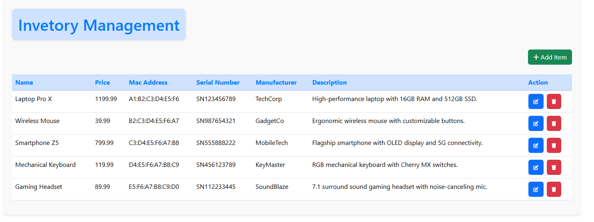
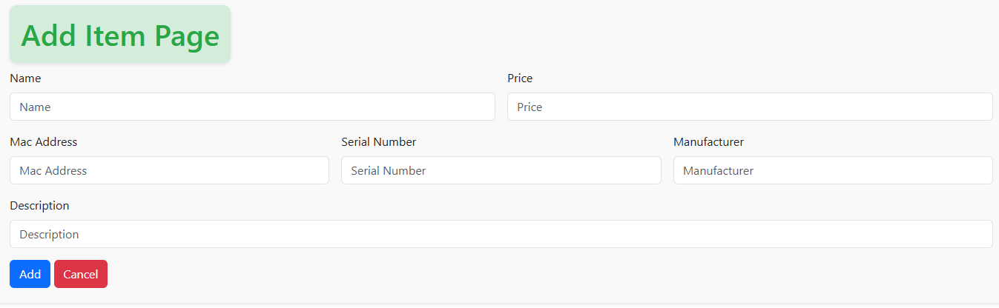
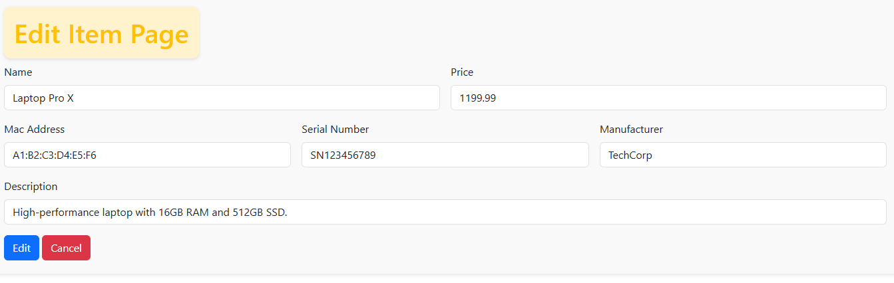

# 📦 Product Inventory App

A comprehensive inventory management CRUD application built with Python Flask, Bootstrap, Jinja2, and MySQL with SQLAlchemy ORM.



## ✨ Features

- 📋 Intuitive inventory management interface
- ➕ Add, edit and delete inventory items
- 📱 Responsive design with Bootstrap
- 🔒 Secure data handling with SQLAlchemy
- 🐳 Containerized with Docker for easy deployment

## 📑 Table of Contents

- [Installation](#installation)
  - [Option 1: Python Only](#option-1-python-only)
  - [Option 2: Docker Compose](#option-2-docker-compose)
- [Environment Variables](#environment-variables)
- [Application Structure](#application-structure)
- [API Endpoints](#api-endpoints)
- [Screenshots](#screenshots)
- [Contributing](#contributing)
- [License](#license)

## 🚀 Installation

### Option 1: Python Only

1. Clone the repository:
   ```
   git clone https://github.com/redmoart23/aht-technical-assessment
   cd aht-technical-assessment
   ```

2. Set up a MySQL database server with a inventory database

3. Create a `.env` file based on the `.env.template` and configure your environment variables

4. Create your virtual enviroment and active it
   ```
   virtualenv venv
   .\venv\Scripts\activate
   ```

5. Install the dependencies:
   ```
   pip install -r requirements.txt
   ```

6. Run the application:
   ```
   python index.py
   ```

7. Access the application at `http://localhost:5000`

### Option 2: Docker Compose

1. Clone the repository:
   ```
   git clone https://github.com/yourusername/inventory-app.git
   cd inventory-app
   ```

2. Make sure you have Docker and Docker Compose installed

3. Create a `.env` file based on the `.env.template` and configure your environment variables

4. Build and run the containers:
   ```
   docker compose up --build
   ```

5. Access the application at `http://localhost:5000`

## 🔧 Environment Variables

Create a `.env` file in the root directory with the following variables:

```
# For development
FLASK_ENV=dev
PORT=5000
SECRET_KEY=your-secret-key

# Database
MYSQL_ROOT_PASSWORD=your-root-password
MYSQL_DATABASE=inventory
SQLALCHEMY_DATABASE_URI=mysql+pymysql://root:${MYSQL_ROOT_PASSWORD}@db:3306/inventory
```

## 📁 Application Structure

```
 ├── models/
 ├── routes/
 └── templates/
     ├── layout.html
     ├── index.html
     ├── add.html
     └── edit.html
 utils/
 static/
 └── styles.css
 app.py
 Dockerfile
 docker-compose.yml
 index.py
 requirements.txt
 .env.template
```

## 🔗 API Endpoints

| Endpoint | Method | Description |
|----------|--------|-------------|
| `/` | GET | 🏠 Main page displaying a list of all inventory items |
| `/add` | GET/POST | ➕ Page for adding a new item to the inventory |
| `/edit/<id>` | GET/POST | ✏️ Page for editing an existing item |
| `/delete/<id>` | POST | 🗑️ Route for deleting an item from the inventory |

## 📸 Screenshots

### Main Inventory Page


### Add Item Form


### Edit Item Form



## 📄 Author

Rafael Eduardo Monsalve.
